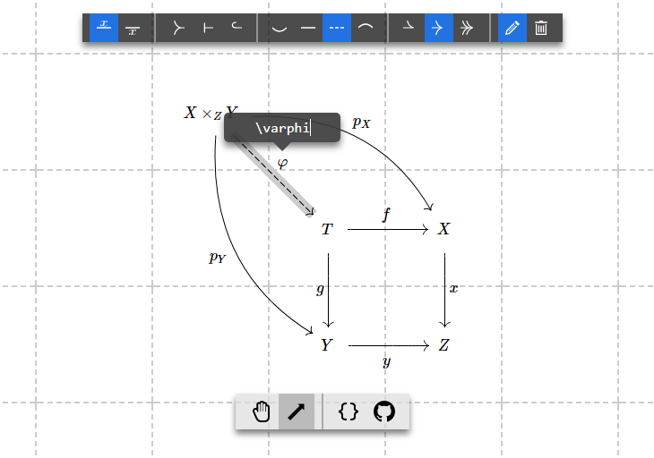

# tikzcd-editor [](https://github.com/yishn/tikzcd-editor/actions)

A simple visual editor for creating commutative diagrams.

You can
[download the latest release](https://github.com/yishn/tikzcd-editor/releases)
to host it on your own or [try it out here](https://tikzcd.yichuanshen.de/).



## Building

Make sure you have [Node.js](https://nodejs.org/) and npm installed. First,
clone this repository:

```
$ git clone https://github.com/yishn/tikzcd-editor
$ cd tikzcd-editor
```

Install dependencies with npm:

```
$ npm install
```

You can build by using the `build` command:

```
$ npm run build
```

This will create a minified bundle `bundle.js` and its source map. To launch,
simply open `index.html` in your favorite modern browser.

Use the `watch` command for development:

```
$ npm run watch
```

To create a self-contained archive file ready for distribution, run the
following command:

```
$ npm run dist
```

This will create a folder and a `zip` file in the `dist` folder.

## Contributing

Bug reports and pull requests are always welcome! Please consult the
[issues list](https://github.com/yishn/tikzcd-editor/issues) for existing issues
beforehand.

You can also support this project by [donating](https://paypal.me/yishn/4).

## Donators

A big thanks to these lovely people:

- Steve Heim
- Max New
- Bingyu Zhang

## Related

- [jsx-tikzcd](https://github.com/yishn/jsx-tikzcd) - Render tikzcd diagrams
  with JSX.
